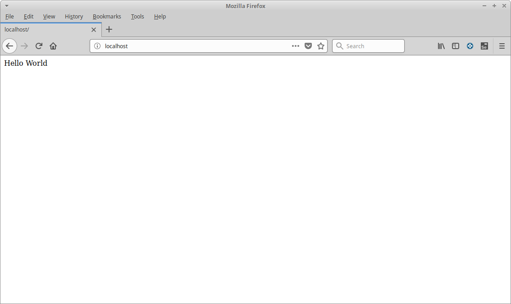

# red-panda-ci-symfony

This is a symfony 4 app example for [red-panda-ci](https://github.com/red-panda-ci) software.

I used the submodule [ci-script](https://github.com/red-panda-ci/ci-scripts) for this test.

## Software required

- [git](https://git-scm.com/)
- [docker](https://www.docker.com/)
- [docker-compose](https://docs.docker.com/compose/)

## Instalation

```console
git clone https://github.com/sergioortegagomez/red-panda-ci-symfony
```

enter to directory red-panda-ci-symfony

```console
cd red-panda-ci-symfony
```

and copy .env.dist file to .env

```console
cp .env.dist .env
```

## How to up?

Easy!

```console
docker-compose up
```

## OK! but... now? How i see... the web?

Open your browser favorite, chrome/firefox by example, and you write:

http://localhost

Then you can see this!



**Congratulations!!** your application is installed correctly!

## :) Yeah!! ...and, the test? How i run the test?

First, down the last environment up with Crtl+C

And you write:

```console
bin/test.sh
```

And you can see this:

```console
Feature: Symfony 4 to explore BDDfire

  Scenario: View Hello World home page # features/bddfire.feature:4
    Given I am on "http://nginx"       # vendor/ruby/2.5.0/gems/bddfire-2.0.8/lib/bddfire/web/web_steps.rb:2
    Then I should see "Hello World"    # vendor/ruby/2.5.0/gems/bddfire-2.0.8/lib/bddfire/web/web_steps.rb:10

  Scenario: Insert 1000 Products             # features/bddfire.feature:8
    Given I am on "http://nginx/insert/1000" # vendor/ruby/2.5.0/gems/bddfire-2.0.8/lib/bddfire/web/web_steps.rb:2
    Then I should see "1000 inserted"        # vendor/ruby/2.5.0/gems/bddfire-2.0.8/lib/bddfire/web/web_steps.rb:10

2 scenarios (2 passed)
4 steps (4 passed)
0m5.466s